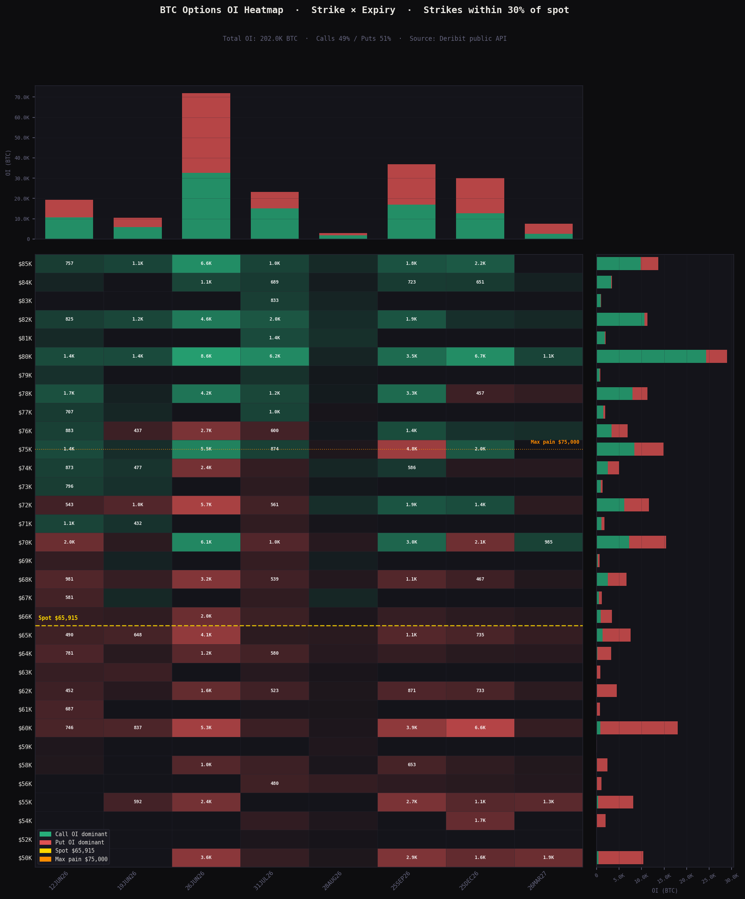

# deribit-options-flow

Deribit BTC/ETH options flow signals — no API key required.

Tracks where sophisticated money is positioned in options markets, which leads perp liquidation cascades on Hyperliquid by 1-4 hours. Feeds into `signal-pipeline` as a tier-2 indexed source.

## OI Heatmap — Strike × Expiry


> *June 3, 2026 snapshot · BTC spot $65,915 · 986 instruments · 202K BTC total OI*

Green = call OI dominant · Red = put OI dominant · Intensity = magnitude
Dashed gold = spot price · Dotted orange = max pain

## Example interpretation (June 3, 2026)

Running the tool on June 3 2026 with BTC at $65,915 produced:

```
Put/Call Ratio (OI)  : 0.619   → bullish (calls dominant)
IV Skew (25d proxy)  : +19.07% → fear premium in puts
Net Premium Flow     : -$7.5M  → recent flow into puts
ATM IV               : 45.7%
Max Pain             : $75,000 → +13.9% above spot
Dominant expiry      : 26JUN26 → IV spike to 70.1% vs ~42% for others

Gamma Walls:
  $60,000  OI=18,048 BTC  (-8.9% from spot)  ← support floor
  $70,000  OI=15,284 BTC  (+6.3% from spot)  ← resistance
  $75,000  OI=14,810 BTC  (+13.9% from spot) ← max pain coincides
```

**Reading:** existing positioning is long-biased (P/C 0.619) with max pain
gravitational pull toward $75K by June 26. The 26JUN26 IV spike to 70.1%
signals the market is pricing a catalyst around that date.

However, recent put flow (-$7.5M) and +19% IV skew reveal late-cycle hedging —
long but nervous. The divergence between OI positioning (bullish) and daily
premium flow (bearish) is the most actionable signal: the crowd is long and
starting to hedge.

Key levels from the heatmap:
- **$60K** — major put wall, accelerates downside if broken
- **$70K** — first gamma wall, dealer buying on the way up
- **$75K** — max pain magnet, June 26 expiry target

This is the structured signal an AI trading agent consumes alongside
[hl-liquidation-heatmap](https://github.com/yodablocks/hl-liquidation-heatmap)
to assess both direction and cascade risk at specific price levels.

## Why options flow leads HL liquidations

```
Deribit large put buying
    → market maker delta hedge (short perps on HL/Binance)
        → selling pressure moves HL price
            → hits liquidation clusters from hl-liquidation-heatmap
                → cascade amplifies the move
                    → more put buying (feedback loop)
```

Options positioning leads perp liquidations by 1-4 hours.
Combined with `hl-liquidation-heatmap` you get:
- **Direction + timing** — from options flow
- **Price targets + cascade levels** — from liquidation cluster map

## Signals

| Signal | Description | Interpretation |
|--------|-------------|----------------|
| `put_call_ratio` | OI-weighted P/C ratio | >1.2 bearish, <0.8 bullish |
| `iv_skew` | 25-delta put IV minus call IV | Positive = fear premium |
| `net_premium_flow` | Call USD volume minus put USD volume | Positive = calls dominant |
| `max_pain` | Strike minimizing option holder payout | Gravitational level into expiry |
| `gamma_wall` | High-OI strikes near spot | Dealer hedge = support/resistance |

## Setup

```bash
pip install -r requirements.txt
```

No API key required — Deribit public endpoints only.

## Usage

```bash
# Signal snapshot
python main.py --currency BTC

# With OI heatmap
python main.py --currency BTC --heatmap oi_heatmap.png && open oi_heatmap.png

# ETH options
python main.py --currency ETH --heatmap eth_oi.png

# JSON output for signal-pipeline ingestion
python main.py --currency BTC --output json
```

## signal-pipeline integration

```python
from deribit_options_flow.fetcher import fetch_options_summary, fetch_index_price
from deribit_options_flow.processor import build_signals
from deribit_options_flow.signal import signals_from_snapshot

spot     = fetch_index_price("BTC")
summary  = fetch_options_summary("BTC")
snapshot = build_signals(summary, spot)
events   = signals_from_snapshot(snapshot, "BTC")
# → list[SignalEvent] with trust="indexed", ready for signal-pipeline
```

## Structure

```
deribit-options-flow/
├── deribit_options_flow/
│   ├── fetcher.py    # Deribit public REST API
│   ├── processor.py  # P/C ratio, IV skew, max pain, gamma walls, term structure
│   └── signal.py     # SignalEvent output for signal-pipeline
├── visualizer.py     # OI heatmap: strike × expiry
├── main.py           # CLI entrypoint
└── requirements.txt
```

> Modules are namespaced under `deribit_options_flow/` rather than exposed as bare
> top-level modules — a bare `fetcher`/`signal` collides with any other installed
> package using the same name (`signal` also shadows Python's stdlib `signal` module).

## Roadmap

- [ ] WebSocket streaming for live IV updates
- [ ] Cross-signal: options flow × HL liquidation level correlation
- [ ] ETH options flow validation
